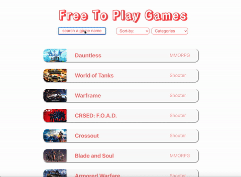

    <a href="https://jeremyoo.github.io/free_to_play_games/">
        <h1>Free_To_Play</h1>
    </a>

Free_To_Play allows you to search for available free games on Epicgames through OpenAPI!

[[Go to Free_To_Play]](https://jeremyoo.github.io/free_to_play_games/)

 

## Features
- View all the available free games
- View a free game in detail
- Search free games by keyword
- Sort free games by
    - alphabetical
    - release-date
    - categories
        
## Exmaples

<!--      -->
<!--      -->

## Issue
Please submit any issue through following link [[Free_To_Play Issue]](https://github.com/jeremyoo/free_to_play_games/issues).

## License
MIT
